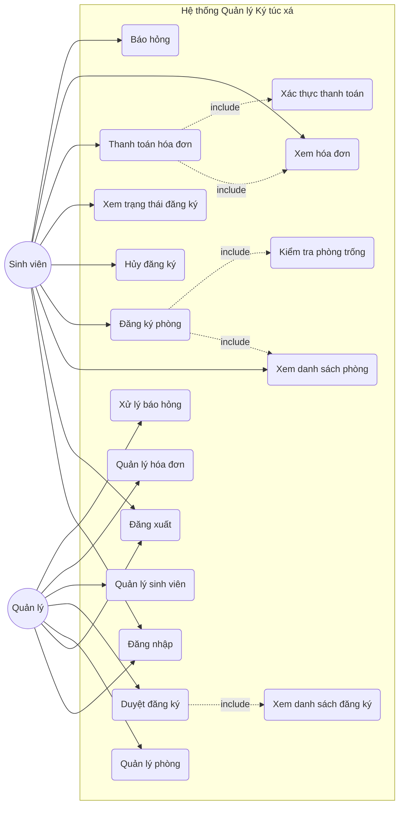
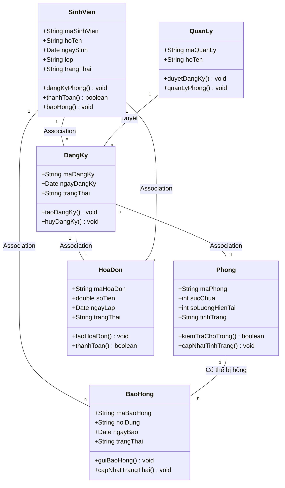
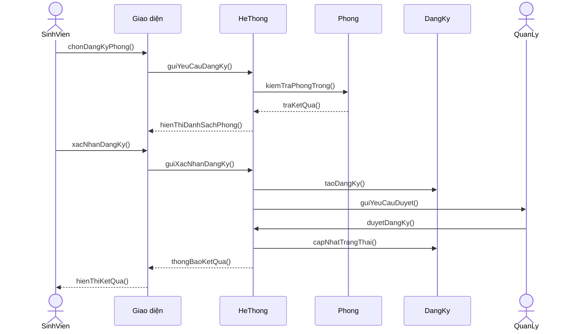
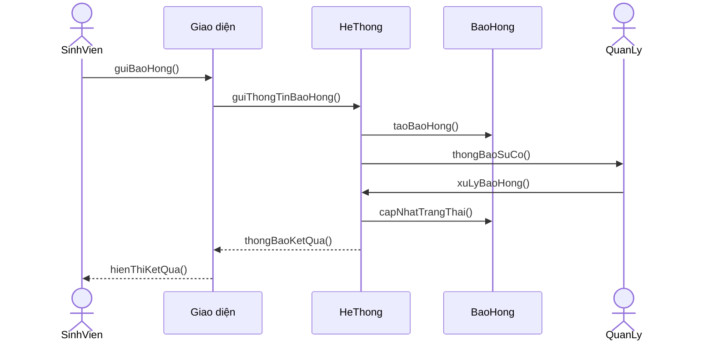
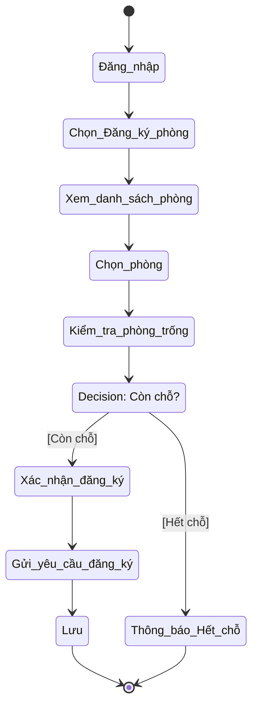
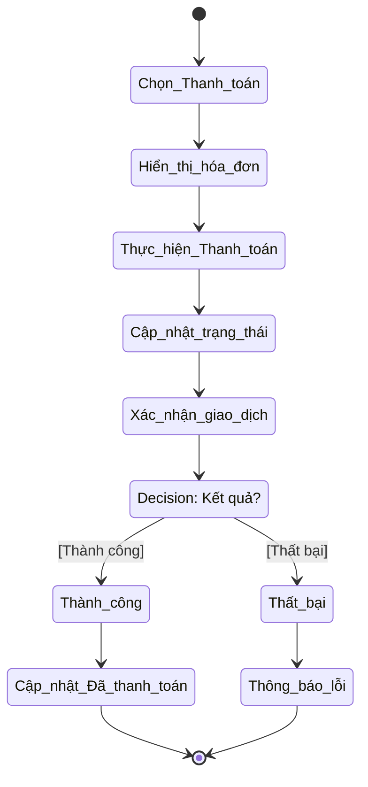
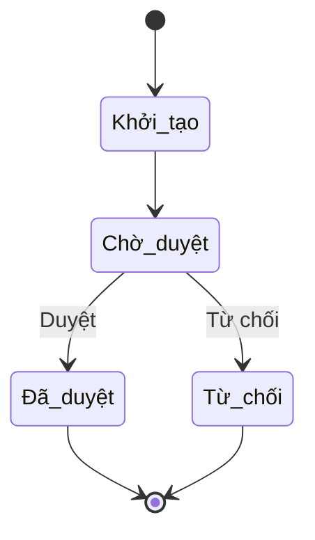
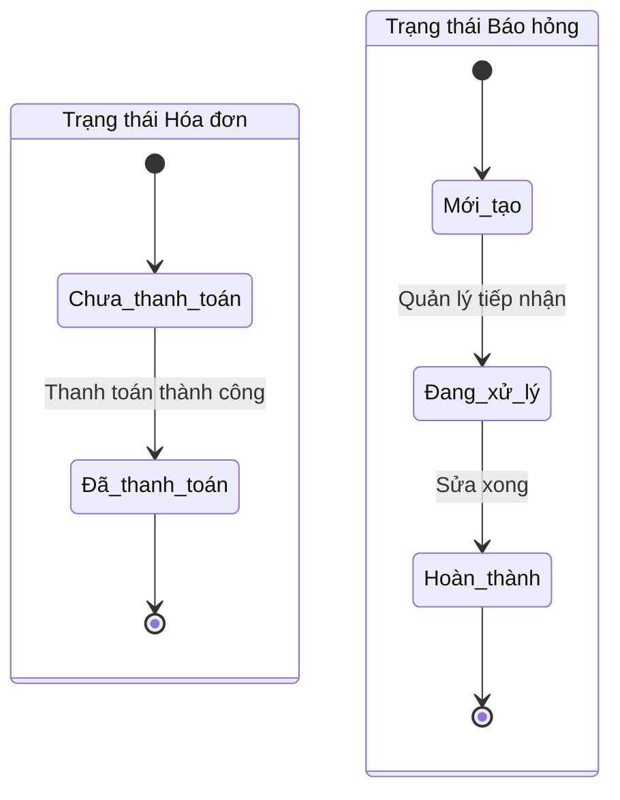

# Mã nguồn Mermaid cho các biểu đồ UML - Quản lý Ký túc xá

Dưới đây là mã nguồn Mermaid cho tất cả các biểu đồ đã được vẽ. Bạn có thể sao chép các đoạn mã này và dán vào [Mermaid Live Editor](https://mermaid.live/) để chỉnh sửa hoặc hiển thị trực tiếp trong các trình xem Markdown hỗ trợ Mermaid (như GitHub, Obsidian, VS Code).

---

## 1. Biểu đồ Use Case

---

## 2. Biểu đồ Lớp (Class Diagram)

---

## 3. Biểu đồ Tuần tự (Sequence Diagram)

### Đăng ký phòng

### Báo hỏng

---

## 4. Biểu đồ Hoạt động (Activity Diagram)

### Đăng ký phòng

### Thanh toán hóa đơn

---

## 5. Biểu đồ Trạng thái (State Diagram)

### Trạng thái Đăng ký

### Trạng thái Hóa đơn và Báo hỏng

